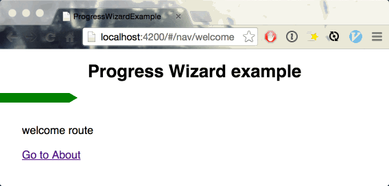

# Progress-wizard-example

This is an *ember-cli* example app that shows an animated progress bar which
state is persisted between routes.

This progress var can be very useful when setting a wizard-like guide
or walkthrough on an ember app that spans across multiple routes.

### How?

The progress bar percentage can be set on each route. When navigating between
these routes the progress bar will be set to the routes `progressPercent`
property and animate accordingly.

The animated progress works just by setting a css `transition` property on the
progress element. See `app/styles/app.css`.

The most importants elements for this progress are:

- `progress-bar` component
- `progress-bar` mixin
- `progressPercent` property that is set on the routes under the nav route.
- `css` to animate the progress bar when the width changes.

## Prerequisites

You will need the following things properly installed on your computer.

* [Git](http://git-scm.com/)
* [Node.js](http://nodejs.org/) (with NPM) and [Bower](http://bower.io/)

## Installation

* `git clone <repository-url>` this repository
* change into the new directory
* `npm install`
* `bower install`

## Running / Development

* `ember server`
* Visit your app at [http://localhost:4200](http://localhost:4200).

### Code Generators

Make use of the many generators for code, try `ember help generate` for more details

### Running Tests

* `ember test`
* `ember test --server`

### Building

* `ember build` (development)
* `ember build --environment production` (production)

### Deploying

Specify what it takes to deploy your app.

## Further Reading / Useful Links

* [ember.js](http://emberjs.com/)
* [ember-cli](http://www.ember-cli.com/)
* Development Browser Extensions
  * [ember inspector for chrome](https://chrome.google.com/webstore/detail/ember-inspector/bmdblncegkenkacieihfhpjfppoconhi)
  * [ember inspector for firefox](https://addons.mozilla.org/en-US/firefox/addon/ember-inspector/)

